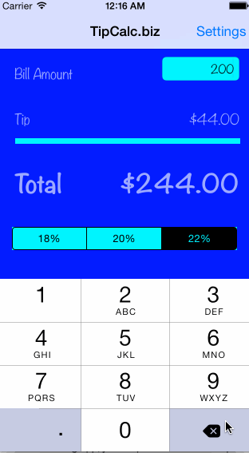

# TipCalc.biz

A lightweight demo tip calculator for the CodePath Bootcamp.

Time spent: 9 hours

Completed user stories:

 * [x] Required: User can enter a bill amount and tip and total values will update in real time
 * [x] Required: User can select from 3 predetermined tip percentages
 * [x] Required: User can select a default tip percentage, accessible from a settings page
 * [x] Optional: Custom design, including new color palette, font, and animation
 * [x] Optional: Last bill amount saved across app restarts within a 10 minute window
 * [x] Optional: Currency style updated to reflect current locale

Walkthrough of all user stories:

GIF created with [LiceCap](http://www.cockos.com/licecap/).
